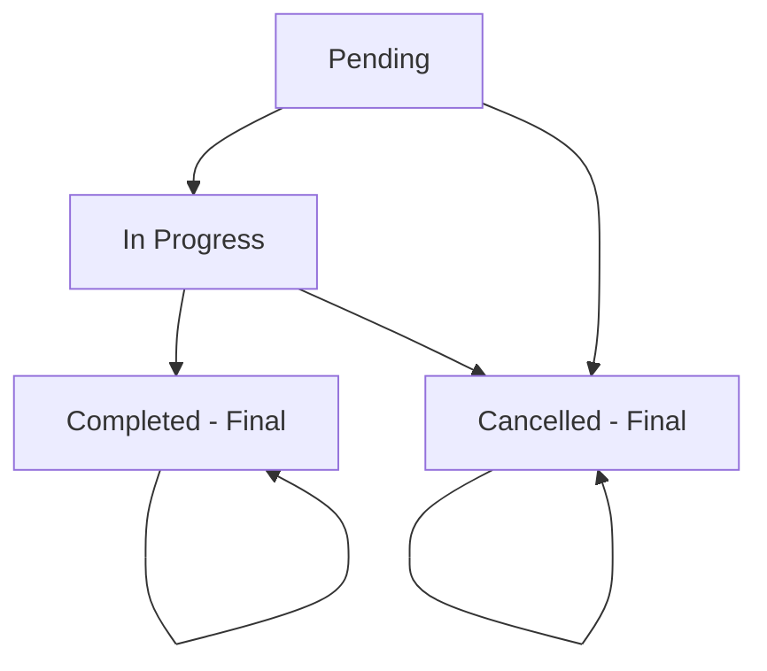

# Maintenance Record Status Management

## Overview

This document describes the implementation of maintenance record status management system that allows technicians to track and update the progress of maintenance work through different status states.

## Status States

The system supports four maintenance record status states:

### 1. **Pending** (รอดำเนินการ)
- **Description**: Initial state when maintenance record is created
- **Color**: Yellow badge
- **Icon**: Clock
- **Available Actions**: Start Work, Cancel
- **Database Value**: `pending`

### 2. **In Progress** (กำลังดำเนินการ)
- **Description**: Work has been started by technician
- **Color**: Blue badge
- **Icon**: Play
- **Available Actions**: Complete Work, Cancel
- **Database Value**: `in_progress`

### 3. **Completed** (เสร็จสิ้น)
- **Description**: Work has been completed successfully
- **Color**: Green badge
- **Icon**: CheckCircle
- **Available Actions**: None (Final state)
- **Database Value**: `completed`
- **Auto-set**: `completedAt` timestamp

### 4. **Cancelled** (ยกเลิก)
- **Description**: Work has been cancelled or postponed
- **Color**: Red badge
- **Icon**: XCircle
- **Available Actions**: None (Final state)
- **Database Value**: `cancelled`

## State Transitions



### Valid Transitions:
- `pending` → `in_progress` (Start Work)
- `pending` → `cancelled` (Cancel Work)
- `in_progress` → `completed` (Complete Work)
- `in_progress` → `cancelled` (Cancel Work)

### Invalid Transitions:
- `completed` → Any other state (Final state)
- `cancelled` → Any other state (Final state)
- Direct `pending` → `completed` (Must go through in_progress)

## API Endpoints

### 1. Update Status (Generic)
```
PATCH /api/records/:id/status
```

**Request Body**:
```json
{
  "status": "pending" | "in_progress" | "completed" | "cancelled"
}
```

**Response**: Updated maintenance record

### 2. Start Work
```
POST /api/records/:id/start
```

**Description**: Changes status from `pending` to `in_progress`
**Request Body**: None
**Response**: Updated maintenance record

### 3. Complete Work
```
POST /api/records/:id/complete
```

**Description**: Changes status from `in_progress` to `completed`
**Request Body**: None
**Response**: Updated maintenance record
**Side Effect**: Sets `completedAt` timestamp

### 4. Cancel Work
```
POST /api/records/:id/cancel
```

**Description**: Changes status to `cancelled` from any state
**Request Body**: None
**Response**: Updated maintenance record

## Database Implementation

### Schema Update
```typescript
export const maintenanceRecords = pgTable("maintenance_records", {
  // ... other fields
  status: varchar("status").notNull().default("pending"), // pending, in_progress, completed, cancelled
  completedAt: timestamp("completed_at"), // Auto-set when completed
  // ... other fields
});
```

### Storage Methods

#### Status Update Method
```typescript
async updateMaintenanceRecordStatus(
  id: number, 
  status: 'pending' | 'in_progress' | 'completed' | 'cancelled', 
  technicianId: string
): Promise<MaintenanceRecord> {
  const existingRecord = await this.getMaintenanceRecord(id);
  if (!existingRecord) {
    throw new Error('Maintenance record not found');
  }

  const updateData: Partial<MaintenanceRecord> = { 
    status, 
    updatedAt: new Date() 
  };

  // Auto-set completedAt when status changes to completed
  if (status === 'completed') {
    updateData.completedAt = new Date();
  }

  return withDatabaseErrorHandling(async () => {
    const [updatedRecord] = await db
      .update(maintenanceRecords)
      .set(updateData)
      .where(eq(maintenanceRecords.id, id))
      .returning();
    return updatedRecord;
  }, 'Maintenance record status update');
}
```

#### Convenience Methods
```typescript
async startMaintenanceWork(id: number, technicianId: string): Promise<MaintenanceRecord> {
  return this.updateMaintenanceRecordStatus(id, 'in_progress', technicianId);
}

async completeMaintenanceWork(id: number, technicianId: string): Promise<MaintenanceRecord> {
  return this.updateMaintenanceRecordStatus(id, 'completed', technicianId);
}

async cancelMaintenanceWork(id: number, technicianId: string): Promise<MaintenanceRecord> {
  return this.updateMaintenanceRecordStatus(id, 'cancelled', technicianId);
}
```

## Frontend Implementation

### Status Actions Component
```typescript
import { StatusActions } from "@/components/status-actions";

// Usage in maintenance record display
<StatusActions 
  record={maintenanceRecord} 
  onStatusChange={(newStatus) => {
    // Handle status change
  }}
/>
```

### Component Features
1. **Status Badge Display**: Visual indication of current status
2. **Action Buttons**: Context-sensitive actions based on current status
3. **Mutation Handling**: Optimistic updates with error handling
4. **Toast Notifications**: User feedback for status changes
5. **Thai Language Support**: All text in Thai

### Status Badge Variants
```typescript
const getStatusBadge = (status: string) => {
  switch (status) {
    case "pending":
      return (
        <Badge variant="secondary" className="bg-yellow-100 text-yellow-800">
          <Clock className="w-3 h-3 mr-1" />
          รอดำเนินการ
        </Badge>
      );
    case "in_progress":
      return (
        <Badge variant="secondary" className="bg-blue-100 text-blue-800">
          <Play className="w-3 h-3 mr-1" />
          กำลังดำเนินการ
        </Badge>
      );
    case "completed":
      return (
        <Badge variant="secondary" className="bg-green-100 text-green-800">
          <CheckCircle className="w-3 h-3 mr-1" />
          เสร็จสิ้น
        </Badge>
      );
    case "cancelled":
      return (
        <Badge variant="secondary" className="bg-red-100 text-red-800">
          <XCircle className="w-3 h-3 mr-1" />
          ยกเลิก
        </Badge>
      );
  }
};
```

## Integration with Existing System

### Dashboard Statistics
The status management integrates with existing dashboard statistics:

```typescript
// Completed this month statistics
const [completedThisMonthResult] = await db
  .select({ count: sql<number>`count(*)` })
  .from(maintenanceRecords)
  .where(
    and(
      eq(maintenanceRecords.status, "completed"),
      gte(maintenanceRecords.maintenanceDate, firstDayOfMonth.toISOString().split('T')[0]),
      lte(maintenanceRecords.maintenanceDate, lastDayOfMonth.toISOString().split('T')[0])
    )
  );
```

### Change Detection
Status changes are subject to the same change detection optimization:

```typescript
// Check if status actually changed
const hasChanges = Object.entries(updateData).some(([key, value]) => {
  return existingRecord[key] !== value;
});

if (!hasChanges) {
  return existingRecord; // No changes, return existing data
}
```

## Error Handling

### Backend Error Handling
```typescript
try {
  const updatedRecord = await storage.updateMaintenanceRecordStatus(id, status, technicianId);
  res.json(updatedRecord);
} catch (error) {
  console.error("Error updating record status:", error);
  res.status(500).json({ message: "Failed to update record status" });
}
```

### Frontend Error Handling
```typescript
const startWorkMutation = useMutation({
  mutationFn: async () => {
    return await apiRequest(`/api/records/${record.id}/start`, {
      method: "POST",
    });
  },
  onError: (error) => {
    toast({
      title: "เกิดข้อผิดพลาด",
      description: "ไม่สามารถเริ่มงานได้",
      variant: "destructive",
    });
  },
});
```

## Usage Examples

### API Usage
```bash
# Start maintenance work
curl -X POST "http://localhost:5000/api/records/1/start" \
  -H "Authorization: Bearer <token>"

# Complete maintenance work
curl -X POST "http://localhost:5000/api/records/1/complete" \
  -H "Authorization: Bearer <token>"

# Cancel maintenance work
curl -X POST "http://localhost:5000/api/records/1/cancel" \
  -H "Authorization: Bearer <token>"

# Generic status update
curl -X PATCH "http://localhost:5000/api/records/1/status" \
  -H "Content-Type: application/json" \
  -H "Authorization: Bearer <token>" \
  -d '{"status": "in_progress"}'
```

### Frontend Usage
```tsx
// In maintenance record list or detail view
import { StatusActions } from "@/components/status-actions";

function MaintenanceRecordCard({ record }) {
  return (
    <div className="card">
      <h3>{record.workDescription}</h3>
      <StatusActions 
        record={record} 
        onStatusChange={(newStatus) => {
          // Refresh data or update local state
          console.log(`Status changed to: ${newStatus}`);
        }}
      />
    </div>
  );
}
```

## Security Considerations

### Authorization
- Only authenticated users can change status
- Technician ID is automatically extracted from JWT token
- No manual technician ID specification to prevent impersonation

### Validation
- Status values are validated using Zod enum
- Record existence is validated before status change
- Invalid status transitions are handled gracefully

### Audit Trail
- All status changes are tracked with timestamps
- `updatedAt` field is automatically updated
- `completedAt` is set only when status becomes `completed`

## Performance Optimizations

### Change Detection
- Status changes are subject to change detection optimization
- No database write if status hasn't actually changed
- Reduced database load and improved response times

### Caching
- Frontend uses React Query for caching
- Cache invalidation on status changes
- Optimistic updates for better UX

## Testing

### Unit Tests
```typescript
describe('Status Management', () => {
  test('should start maintenance work', async () => {
    const record = await storage.startMaintenanceWork(1, 'tech123');
    expect(record.status).toBe('in_progress');
  });

  test('should complete maintenance work', async () => {
    const record = await storage.completeMaintenanceWork(1, 'tech123');
    expect(record.status).toBe('completed');
    expect(record.completedAt).toBeDefined();
  });

  test('should cancel maintenance work', async () => {
    const record = await storage.cancelMaintenanceWork(1, 'tech123');
    expect(record.status).toBe('cancelled');
  });
});
```

### Integration Tests
```bash
# Test status workflow
POST /api/records/1/start    # pending -> in_progress
POST /api/records/1/complete # in_progress -> completed

# Test error cases
POST /api/records/999/start  # Should return 404
```

## Future Enhancements

### 1. Status History
Track all status changes with timestamps:
```typescript
export const maintenanceRecordStatusHistory = pgTable("maintenance_record_status_history", {
  id: serial("id").primaryKey(),
  recordId: integer("record_id").references(() => maintenanceRecords.id),
  fromStatus: varchar("from_status"),
  toStatus: varchar("to_status"),
  changedBy: varchar("changed_by").references(() => users.id),
  changedAt: timestamp("changed_at").defaultNow(),
  notes: text("notes"),
});
```

### 2. Workflow Rules
Define business rules for status transitions:
```typescript
const statusTransitionRules = {
  pending: ['in_progress', 'cancelled'],
  in_progress: ['completed', 'cancelled'],
  completed: [], // Final state
  cancelled: [], // Final state
};
```

### 3. Time Tracking
Track duration in each status:
```typescript
const statusDurations = {
  pending: calculateDuration(createdAt, startedAt),
  in_progress: calculateDuration(startedAt, completedAt),
  total: calculateDuration(createdAt, completedAt),
};
```

### 4. Notifications
Send notifications on status changes:
```typescript
// Email/SMS notifications when work is completed
if (status === 'completed') {
  await sendNotification(record.assignedSupervisor, {
    type: 'maintenance_completed',
    record: record,
  });
}
```

This status management system provides a comprehensive solution for tracking maintenance work progress while maintaining data integrity and providing excellent user experience.