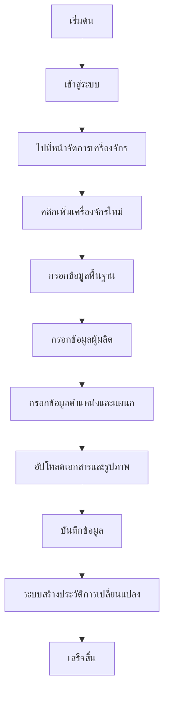
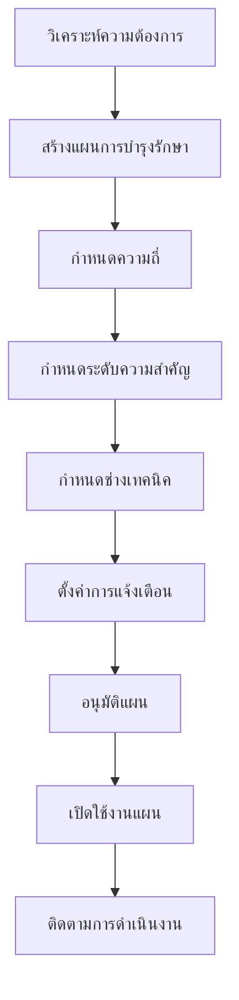
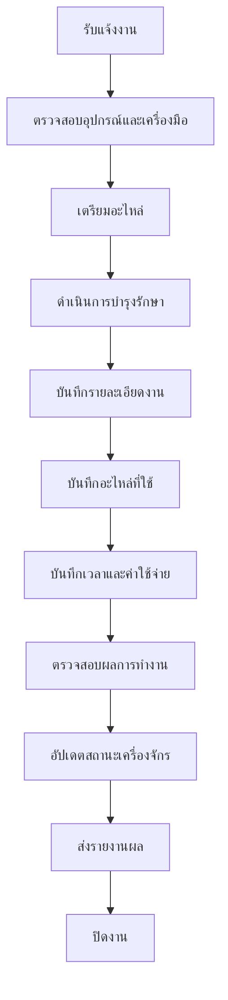
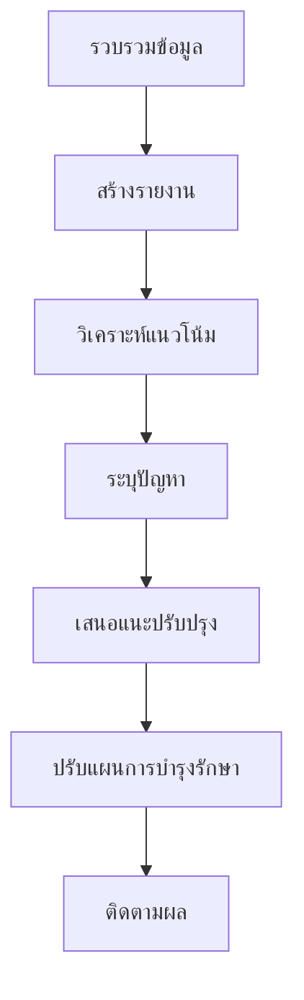

# คู่มือการทำงานและขั้นตอนการใช้งานระบบ (Workflow Guide)

## ภาพรวมของระบบ

ระบบบำรุงรักษาเครื่องจักรประจำปีได้รับการออกแบบมาเพื่อจัดการกระบวนการบำรุงรักษาเครื่องจักรอย่างเป็นระบบ โดยแบ่งผู้ใช้งานออกเป็น 3 กลุมหลัก:

1. **ผู้จัดการ (Manager)**: วางแผนและติดตามการบำรุงรักษา
2. **ช่างเทคนิค (Technician)**: ดำเนินการบำรุงรักษาและบันทึกผล
3. **ผู้ดูแลระบบ (Administrator)**: จัดการระบบและผู้ใช้งาน

## ขั้นตอนการทำงานหลัก (Main Workflows)

### 1. การเพิ่มเครื่องจักรเข้าระบบ



**ขั้นตอนละเอียด:**
1. **เข้าสู่ระบบ** ด้วยบัญชี Replit
2. **เลือกเมนู** "จัดการเครื่องจักร"
3. **คลิกปุ่ม** "เพิ่มเครื่องจักรใหม่"
4. **กรอกข้อมูลที่จำเป็น:**
   - รหัสเครื่องจักร (ไม่ซ้ำกัน)
   - ชื่อเครื่องจักร
   - ประเภทเครื่องจักร
   - ตำแหน่งที่ตั้ง
   - แผนกที่รับผิดชอบ
   - สถานะเริ่มต้น
5. **กรอกข้อมูลเพิ่มเติม** (ถ้ามี)
6. **บันทึกข้อมูล**

### 2. การวางแผนการบำรุงรักษา



**รายละเอียดการวางแผน:**

#### ระดับความสำคัญ:
- **สูง**: การบำรุงรักษาที่จำเป็นต่อความปลอดภัยหรือการผลิต
- **กลาง**: การบำรุงรักษาป้องกันปกติ
- **ต่ำ**: การตรวจสอบหรือการบำรุงรักษาเล็กน้อย

#### ประเภทการบำรุงรักษา:
- **ป้องกัน (Preventive)**: ทำตามกำหนดเวลาเพื่อป้องกันปัญหา
- **แก้ไข (Corrective)**: แก้ไขปัญหาที่เกิดขึ้น
- **ฉุกเฉิน (Emergency)**: แก้ไขปัญหาเร่งด่วน

### 3. การดำเนินการบำรุงรักษา



**ขั้นตอนการบันทึก:**
1. **เลือกเครื่องจักร** ที่ทำการบำรุงรักษา
2. **เลือกแผน** ที่เกี่ยวข้อง (ถ้ามี)
3. **บันทึกเวลาเริ่ม-สิ้นสุด** การทำงาน
4. **ระบุรายละเอียดงาน** ที่ทำ
5. **บันทึกอะไหล่และเครื่องมือ** ที่ใช้
6. **ระบุค่าใช้จ่าย** ทั้งหมด
7. **อัปเดตสถานะ** เครื่องจักร
8. **บันทึกหมายเหตุ** หรือข้อสังเกต

### 4. การติดตามและวิเคราะห์



## ขั้นตอนการทำงานตามบทบาท (Role-based Workflows)

### ผู้จัดการ (Manager)

#### การทำงานประจำวัน:
1. **ตรวจสอบแดชบอร์ด** เพื่อดูสถานะภาพรวม
2. **ตรวจสอบงานที่เลยกำหนด** และดำเนินการแก้ไข
3. **อนุมัติแผนการบำรุงรักษาใหม่**
4. **ตรวจสอบรายงานค่าใช้จ่าย**

#### การทำงานประจำสัปดาห์:
1. **สร้างรายงานสรุป** ผลการดำเนินงาน
2. **วางแผนการบำรุงรักษา** สำหรับสัปดาห์ถัดไป
3. **ประเมินประสิทธิภาพช่างเทคนิค**
4. **วิเคราะห์แนวโน้มค่าใช้จ่าย**

#### การทำงานประจำเดือน:
1. **จัดทำรายงานประจำเดือน**
2. **ทบทวนแผนการบำรุงรักษา**
3. **วางแผนงบประมาณ**
4. **ประเมินประสิทธิภาพเครื่องจักร**

### ช่างเทคนิค (Technician)

#### เริ่มต้นวันทำงาน:
1. **เข้าสู่ระบบ** และตรวจสอบงานประจำวัน
2. **ตรวจสอบอุปกรณ์และเครื่องมือ**
3. **เตรียมอะไหล่** ที่อาจต้องใช้
4. **วางแผนลำดับการทำงาน**

#### การทำงาน:
1. **รับงาน** จากระบบหรือผู้จัดการ
2. **ตรวจสอบรายละเอียดงาน**
3. **ดำเนินการตามขั้นตอน**
4. **บันทึกผลการทำงาน** ทันทีหลังเสร็จ
5. **อัปเดตสถานะงาน**

#### สิ้นสุดวันทำงาน:
1. **ส่งรายงานสรุป** งานที่ทำวันนั้น
2. **ตรวจสอบงานที่รอดำเนินการ**
3. **เตรียมงานสำหรับวันถัดไป**

### ผู้ดูแลระบบ (Administrator)

#### การทำงานประจำ:
1. **ตรวจสอบระบบ** และประสิทธิภาพการทำงาน
2. **สำรองข้อมูล** เป็นประจำ
3. **จัดการบัญชีผู้ใช้งาน**
4. **อัปเดตระบบ** เมื่อจำเป็น

## แผนผังการไหลของข้อมูล (Data Flow)

### การไหลของข้อมูลเครื่องจักร:
```
เพิ่มเครื่องจักร → บันทึกข้อมูล → สร้างประวัติ → แสดงในรายการ
     ↓
อัปเดตข้อมูล → บันทึกการเปลี่ยนแปลง → แสดงในประวัติ
```

### การไหลของข้อมูลการบำรุงรักษา:
```
สร้างแผน → กำหนดกำหนดเวลา → แจ้งเตือน → ดำเนินการ → บันทึกผล → ปิดงาน
    ↓                                                          ↓
อัปเดตแผน ←────────────────────────────────────────── สร้างงานใหม่
```

## เคล็ดลับการทำงานอย่างมีประสิทธิภาพ

### สำหรับผู้จัดการ:
1. **ใช้แดชบอร์ด** เป็นจุดเริ่มต้นทุกวัน
2. **ตั้งค่าการแจ้งเตือน** สำหรับงานที่สำคัญ
3. **สร้างรายงาน** เป็นประจำเพื่อติดตามแนวโน้ม
4. **วางแผนล่วงหน้า** อย่างน้อย 1 เดือน

### สำหรับช่างเทคนิค:
1. **บันทึกข้อมูล** ทันทีหลังทำงานเสร็จ
2. **ถ่ายรูป** หรือบันทึกหลักฐานการทำงาน
3. **ระบุปัญหา** ที่อาจเกิดขึ้นในอนาคต
4. **แจ้งปัญหา** ที่พบทันที

### สำหรับผู้ดูแลระบบ:
1. **สำรองข้อมูล** อย่างสม่ำเสมอ
2. **ตรวจสอบประสิทธิภาพ** ระบบเป็นประจำ
3. **อัปเดตคู่มือ** เมื่อมีการเปลี่ยนแปลง
4. **ฝึกอบรม** ผู้ใช้งานใหม่

## การแก้ไขปัญหาเบื้องต้น

### ปัญหาที่พบบ่อย:

#### 1. ไม่สามารถเข้าสู่ระบบได้
**สาเหตุ:** ปัญหาการเชื่อมต่อหรือการตั้งค่า
**วิธีแก้:**
- ตรวจสอบการเชื่อมต่ออินเทอร์เน็ต
- ลองรีเฟรชหน้าเว็บ
- ลบ cache ของเบราว์เซอร์
- ติดต่อผู้ดูแลระบบ

#### 2. ข้อมูลไม่อัปเดต
**สาเหตุ:** ปัญหาการซิงค์ข้อมูล
**วิธีแก้:**
- รีเฟรชหน้าเว็บ
- ออกจากระบบแล้วเข้าใหม่
- ตรวจสอบการเชื่อมต่อเครือข่าย

#### 3. ไม่สามารถบันทึกข้อมูลได้
**สาเหตุ:** ข้อมูลไม่ครบถ้วนหรือผิดรูปแบบ
**วิธีแก้:**
- ตรวจสอบช่องที่จำเป็นทั้งหมด
- ตรวจสอบรูปแบบข้อมูล (วันที่, ตัวเลข)
- ลองบันทึกใหม่

## การสำรองและกู้คืนข้อมูล

### การสำรองข้อมูล:
1. **อัตโนมัติ**: ระบบสำรองข้อมูลทุกวันที่ 02:00 น.
2. **ด้วยตนเอง**: ผู้ดูแลสามารถสำรองเพิ่มเติมได้
3. **การเก็บรักษา**: ข้อมูลสำรองเก็บไว้ 30 วัน

### การกู้คืนข้อมูล:
1. **ระดับผู้ใช้**: กู้คืนข้อมูลที่ลบผิดพลาด
2. **ระดับระบบ**: กู้คืนจากความเสียหายของระบบ
3. **ขั้นตอน**: ติดต่อผู้ดูแลระบบพร้อมระบุวันที่และข้อมูลที่ต้องการ

## เวอร์ชันและการอัปเดต

### การติดตามเวอร์ชัน:
- **เวอร์ชันปัจจุบัน**: v1.0.0
- **ประวัติการอัปเดต**: บันทึกไว้ในเอกสารแยก
- **การแจ้งเตือน**: ระบบจะแจ้งเมื่อมีอัปเดตใหม่

### การอัปเดตระบบ:
1. **การเตรียมการ**: สำรองข้อมูลก่อนอัปเดต
2. **การทดสอบ**: ทดสอบในสภาพแวดล้อมแยก
3. **การปรับใช้**: อัปเดตในเวลาที่เหมาะสม
4. **การตรวจสอบ**: ยืนยันการทำงานหลังอัปเดต